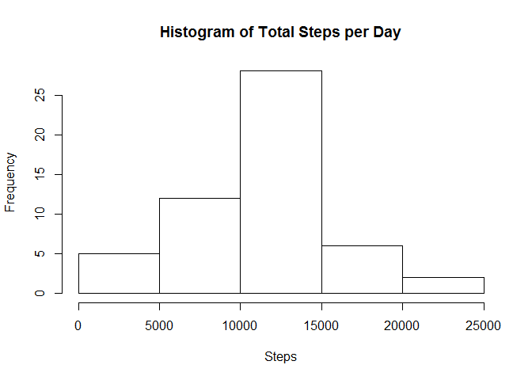
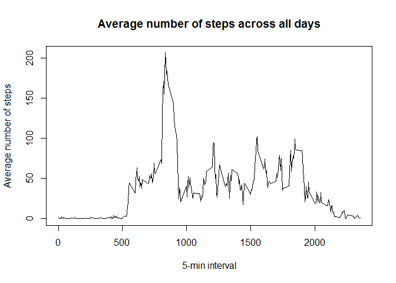
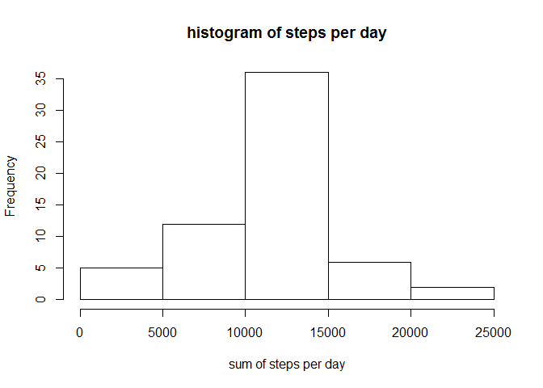
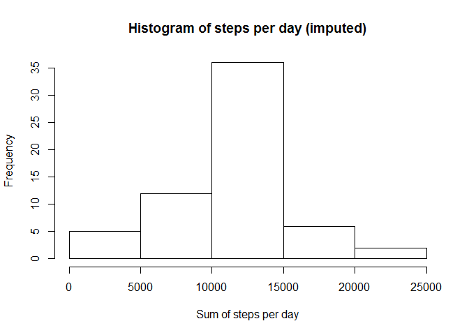
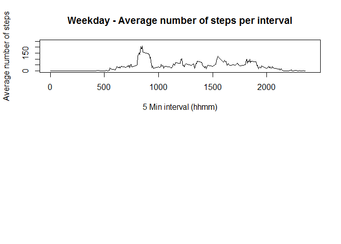
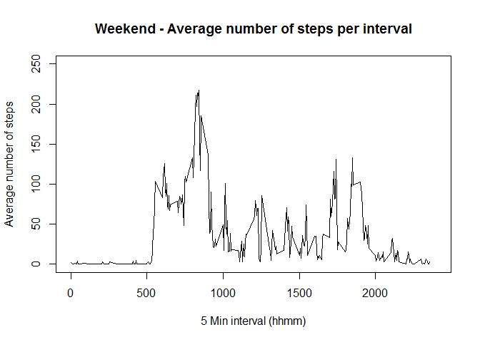

#Reproducible Research

#Peer-graded Assignment: Course Project 1

by Segran Pillay


##Instructions
###Introduction
It is now possible to collect a large amount of data about personal movement using activity monitoring devices such as a Fitbit, Nike Fuelband, or Jawbone Up. These type of devices are part of the "quantified self" movement - a group of enthusiasts who take measurements about themselves regularly to improve their health, to find patterns in their behavior, or because they are tech geeks. But these data remain under-utilized both because the raw data are hard to obtain and there is a lack of statistical methods and software for processing and interpreting the data.

This assignment makes use of data from a personal activity monitoring device. This device collects data at 5 minute intervals through out the day. The data consists of two months of data from an anonymous individual collected during the months of October and November, 2012 and include the number of steps taken in 5 minute intervals each day.

The data for this assignment can be downloaded from the course web site:

* Dataset: [Activity monitoring data](https://d396qusza40orc.cloudfront.net/repdata%2Fdata%2Factivity.zip) [52K]


The variables included in this dataset are:

* steps: Number of steps taking in a 5-minute interval (missing values are coded as NA)

* date: The date on which the measurement was taken in YYYY-MM-DD format

* interval: Identifier for the 5-minute interval in which measurement was taken

The dataset is stored in a comma-separated-value (CSV) file and there are a total of 17,568 observations in this dataset.

##Loading and preprocessing the data
###Load the data

```r
echo = TRUE
setwd("~/Reproducible Data")
activity <- read.csv("activity.csv", header = T, sep = ",")
```


##*Processing/transforming the data into suitable format for analysis*

####Converting date field to date type with only weekdays


```r
activity$day <- weekdays(as.Date(activity$date))
activity$DateTime<- as.POSIXct(activity$date, format="%Y-%m-%d")

myData <- activity[!is.na(activity$steps),]

df_summary <- NULL
```

#What is mean total number of steps taken per day?

1. Calculate the total number of steps taken per day?

```r
echo = TRUE
totalSum <- tapply(activity$steps, activity$date, sum, na.rm=T)
as.table(totalSum)
```

```
## 2012-10-01 2012-10-02 2012-10-03 2012-10-04 2012-10-05 2012-10-06 
##          0        126      11352      12116      13294      15420 
## 2012-10-07 2012-10-08 2012-10-09 2012-10-10 2012-10-11 2012-10-12 
##      11015          0      12811       9900      10304      17382 
## 2012-10-13 2012-10-14 2012-10-15 2012-10-16 2012-10-17 2012-10-18 
##      12426      15098      10139      15084      13452      10056 
## 2012-10-19 2012-10-20 2012-10-21 2012-10-22 2012-10-23 2012-10-24 
##      11829      10395       8821      13460       8918       8355 
## 2012-10-25 2012-10-26 2012-10-27 2012-10-28 2012-10-29 2012-10-30 
##       2492       6778      10119      11458       5018       9819 
## 2012-10-31 2012-11-01 2012-11-02 2012-11-03 2012-11-04 2012-11-05 
##      15414          0      10600      10571          0      10439 
## 2012-11-06 2012-11-07 2012-11-08 2012-11-09 2012-11-10 2012-11-11 
##       8334      12883       3219          0          0      12608 
## 2012-11-12 2012-11-13 2012-11-14 2012-11-15 2012-11-16 2012-11-17 
##      10765       7336          0         41       5441      14339 
## 2012-11-18 2012-11-19 2012-11-20 2012-11-21 2012-11-22 2012-11-23 
##      15110       8841       4472      12787      20427      21194 
## 2012-11-24 2012-11-25 2012-11-26 2012-11-27 2012-11-28 2012-11-29 
##      14478      11834      11162      13646      10183       7047 
## 2012-11-30 
##          0
```


2. Histogram of the total number of steps taken each day

 *Calculating the mean number of steps take per day?*

```r
dataSum <- aggregate(activity$steps ~ activity$date, FUN = sum)
colnames(dataSum)<- c("Date", "Steps")
```

*Plotting the data to histogram of steps per day*

```r
hist(dataSum$Steps, xlab = "Steps", main = "Histogram of Total Steps per Day")
```

<!-- -->

3. Mean and median number of steps taken each day

```r
summary(dataSum)
```

```
##          Date        Steps      
##  2012-10-02: 1   Min.   :   41  
##  2012-10-03: 1   1st Qu.: 8841  
##  2012-10-04: 1   Median :10765  
##  2012-10-05: 1   Mean   :10766  
##  2012-10-06: 1   3rd Qu.:13294  
##  2012-10-07: 1   Max.   :21194  
##  (Other)   :47
```

```r
median_sum <- median(dataSum$Steps)
mean_sum <- mean(dataSum$Steps)
```
**The median is 10765 and mean is 10766.**

#What is the average daily activity pattern?

1. Make a time series plot (i.e. type = "l") of the 5-minute interval (x-axis) and the average number of steps taken, averaged across all days (y-axis)


```r
echo = TRUE
fiveMinInterval <- tapply(activity$steps, activity$interval, mean, na.rm=T)
plot(fiveMinInterval ~ unique(activity$interval), type="l", xlab = "5-min interval", ylab = "Average number of steps", main = "Average number of steps across all days")
```

<!-- -->


2. Which 5-minute interval, on average across all the days in the dataset, contains the maximum number of steps?


```r
echo = TRUE
fiveMinInterval[which.max(fiveMinInterval)]
```

```
##      835 
## 206.1698
```

**Interval is at 835 with 206.1698 steps.**

#Imputing missing values

Note that there are a number of days/intervals where there are missing values (coded as NA). The presence of missing days may introduce bias into some calculations or summaries of the data.

1. Calculate and report the total number of missing values in the dataset (i.e. the total number of rows with NAs)


```r
echo = TRUE
table(is.na(activity) == TRUE)
```

```
## 
## FALSE  TRUE 
## 85536  2304
```

**There are 2304 NA rows.**


2.Devise a strategy for filling in all of the missing values in the dataset. The strategy does not need to be sophisticated. For example, you could use the mean/median for that day, or the mean for that 5-minute interval, etc.

**The strategy adopted:**
- I replace NA value with the mean (of steps) for the 5-minute interval


```r
echo = TRUE
activity2 <- activity  # dataset with no NAs
for (i in 1:nrow(activity)){
    if(is.na(activity$steps[i])){
        activity2$steps[i]<- fiveMinInterval[[as.character(activity[i, "interval"])]]
    }
}
```

Plotting Histogram


```r
echo = TRUE
dataSum2 <- tapply(activity2$steps, activity2$date, sum, na.rm=T)
hist(dataSum2, xlab = "sum of steps per day", main = "histogram of steps per day")
```

<!-- -->

Calculating mean and median


```r
mean_sum2 <- round(mean(dataSum2))
median_sum2 <- round(median(dataSum2))
```

**The mean is 10766 and median is 10766.**


3. Create a new dataset that is equal to the original dataset but with the missing data filled in.


```r
echo = TRUE
df_summary <- rbind(df_summary, data.frame(mean = c(mean_sum, mean_sum2), median = c(median_sum, median_sum2)))
rownames(df_summary) <- c("with NA's", "without NA's")
print(df_summary)
```

```
##                  mean median
## with NA's    10766.19  10765
## without NA's 10766.00  10766
```

Comparing with NA's and without:


```r
echo = TRUE
summary(activity2)
```

```
##      steps                date          interval          day           
##  Min.   :  0.00   2012-10-01:  288   Min.   :   0.0   Length:17568      
##  1st Qu.:  0.00   2012-10-02:  288   1st Qu.: 588.8   Class :character  
##  Median :  0.00   2012-10-03:  288   Median :1177.5   Mode  :character  
##  Mean   : 37.38   2012-10-04:  288   Mean   :1177.5                     
##  3rd Qu.: 27.00   2012-10-05:  288   3rd Qu.:1766.2                     
##  Max.   :806.00   2012-10-06:  288   Max.   :2355.0                     
##                   (Other)   :15840                                      
##     DateTime         
##  Min.   :2012-10-01  
##  1st Qu.:2012-10-16  
##  Median :2012-10-31  
##  Mean   :2012-10-31  
##  3rd Qu.:2012-11-15  
##  Max.   :2012-11-30  
## 
```

**Above table confirms there is no more NAs in the steps variable**


4. Make a histogram of the total number of steps taken each day and Calculate and report the mean and median total number of steps taken per day. Do these values differ from the estimates from the first part of the assignment? What is the impact of imputing missing data on the estimates of the total daily number of steps?


```r
echo = TRUE
dataSum2 <- tapply(activity2$steps, activity2$date, sum, na.rm=T)
hist(dataSum2, xlab = "Sum of steps per day", main = "Histogram of steps per day (imputed)")
```

<!-- -->


```r
print(df_summary)
```

```
##                  mean median
## with NA's    10766.19  10765
## without NA's 10766.00  10766
```
**Mean values stays the same but there is slight difference in meadian value.**


#Are there differences in activity patterns between weekdays and weekends?

For this part the weekdays() function may be of some help here. Use the dataset with the filled-in missing values for this part.

1. Create a new factor variable in the dataset with two levels - "weekday" and "weekend" indicating whether a given date is a weekday or weekend day.


```r
activity2$date <- as.character(activity2$date)
activity2$date <- as.Date(activity2$date)

weekdays <- (weekdays(activity2$date))

activity2$weekdays <- as.factor(weekdays)

levels(activity2$weekdays) <- c("weekday", "weekday", "weekday", "weekday", 
    "weekday", "weekend", "weekend")
```


```r
which_weekdays <- activity2$weekdays == "weekday"  ## subset weekday rows
which_weekends <- activity2$weekdays == "weekend"  ## subset weekend rows

## Calculating average number of steps per interval across weekdays and
## weekends
StepsPerInterval_weekday <- tapply(activity2$steps[which_weekdays], as.factor(activity$interval[which_weekdays]), 
    mean, na.rm = T)
StepsPerInterval_weekend <- tapply(activity2$steps[which_weekends], as.factor(activity$interval[which_weekends]), 
    mean, na.rm = T)

## Plot results in panel plot
par(mfcol = c(2, 1))

plot(levels(as.factor(activity2$interval)), StepsPerInterval_weekday, type = "l", 
    xlab = "5 Min interval (hhmm)", ylab = "Average number of steps", main = "Weekday - Average number of steps per interval", 
    ylim = range(0:250), xlim = range(0:2400))
```

<!-- -->


```r
plot(levels(as.factor(activity2$interval)), StepsPerInterval_weekend, type = "l", 
    xlab = "5 Min interval (hhmm)", ylab = "Average number of steps", main = "Weekend - Average number of steps per interval", 
    ylim = range(0:250), xlim = range(0:2400))
```

<!-- -->

**A small difference is observed only.**
